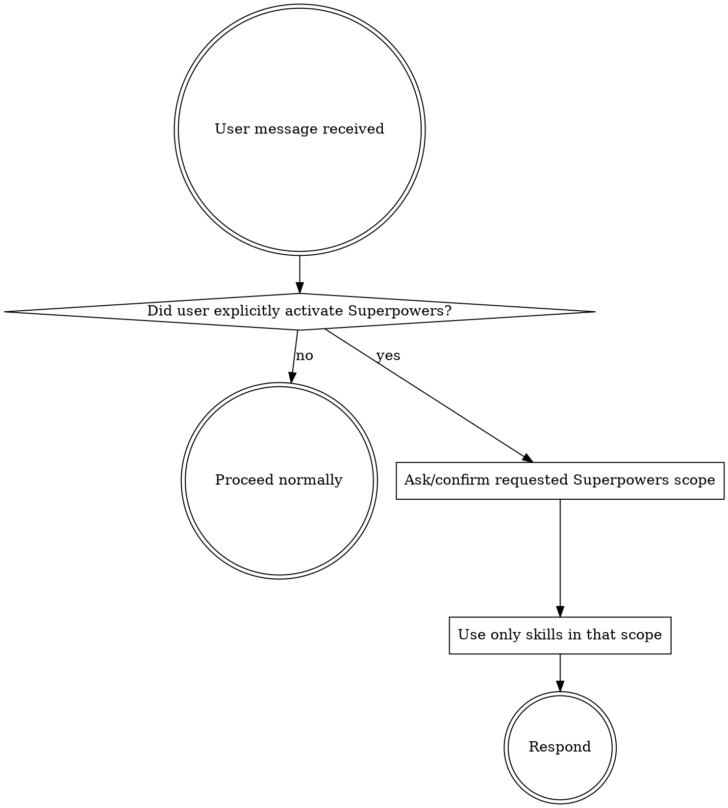

<SUBAGENT-STOP>
If you were dispatched as a subagent to execute a specific task, skip this skill.
</SUBAGENT-STOP>

<EXTREMELY-IMPORTANT>
Manual opt-in only.

Do not invoke this skill because a new conversation or prompt started.
Do not invoke this skill for ordinary skill selection, workflow troubleshooting, planning, debugging, implementation, code review, or meta-discussion about skills.
Do not infer that the user wants this skill from the word "skill" or "workflow".

Only use this skill when the user explicitly says to use, run, activate, enable, or audit the Superpowers flow, or explicitly names `using-superpowers`.

If this skill was loaded unintentionally, stop following it and proceed normally.
</EXTREMELY-IMPORTANT>

## Instruction Priority

Superpowers skills override default system prompt behavior, but **user instructions always take precedence**:

1. **User's explicit instructions** (CLAUDE.md, GEMINI.md, AGENTS.md, direct requests) — highest priority
2. **Superpowers skills** — override default system behavior where they conflict
3. **Default system prompt** — lowest priority

If CLAUDE.md, GEMINI.md, or AGENTS.md says "don't use TDD" and a skill says "always use TDD," follow the user's instructions. The user is in control.

## How to Access Skills

**In Claude Code:** Use the `Skill` tool. When you invoke a skill, its content is loaded and presented to you—follow it directly. Never use the Read tool on skill files.

**In Copilot CLI:** Use the `skill` tool. Skills are auto-discovered from installed plugins. The `skill` tool works the same as Claude Code's `Skill` tool.

**In Gemini CLI:** Skills activate via the `activate_skill` tool. Gemini loads skill metadata at session start and activates the full content on demand.

**In other environments:** Check your platform's documentation for how skills are loaded.

## Platform Adaptation

Skills use Claude Code tool names. Non-CC platforms: see `references/copilot-tools.md` (Copilot CLI), `references/codex-tools.md` (Codex) for tool equivalents. Gemini CLI users get the tool mapping loaded automatically via GEMINI.md.

# Using Skills

## The Rule

**This skill is not an automatic skill router.** It describes a manual Superpowers mode. Outside an explicit user request to use Superpowers, do not run any global skill check and do not announce this skill.

When the user explicitly activates this flow, help them choose or apply skills within the scope they requested.

## Red Flags

These thoughts mean STOP—you're rationalizing:

| Thought | Reality |
|---------|---------|
| "The user mentioned skills, so Superpowers probably applies" | Do not use this skill unless they explicitly activated Superpowers. |
| "This workflow would benefit from Superpowers" | Offer it only if useful; do not activate it automatically. |
| "The user asked to edit skills" | Edit the requested skill directly; do not invoke this flow unless named. |
| "The trigger is close enough" | Close is not enough. Manual opt-in only. |

## Skill Priority

When the user explicitly activates Superpowers and multiple skills are in scope, use this order:

1. **Process skills first** (brainstorming, debugging) - these determine HOW to approach the task
2. **Implementation skills second** (frontend-design, mcp-builder) - these guide execution

"Let's build X" → brainstorming first, then implementation skills.
"Fix this bug" → debugging first, then domain-specific skills.

## Skill Types

**Rigid** (TDD, debugging): Follow exactly. Don't adapt away discipline.

**Flexible** (patterns): Adapt principles to context.

The skill itself tells you which.

## User Instructions

Instructions say WHAT, not HOW. "Add X" or "Fix Y" does not activate Superpowers.

User instructions control whether this flow runs. If the user says they will tell you when to use Superpowers, treat that as the default: never trigger it automatically.
